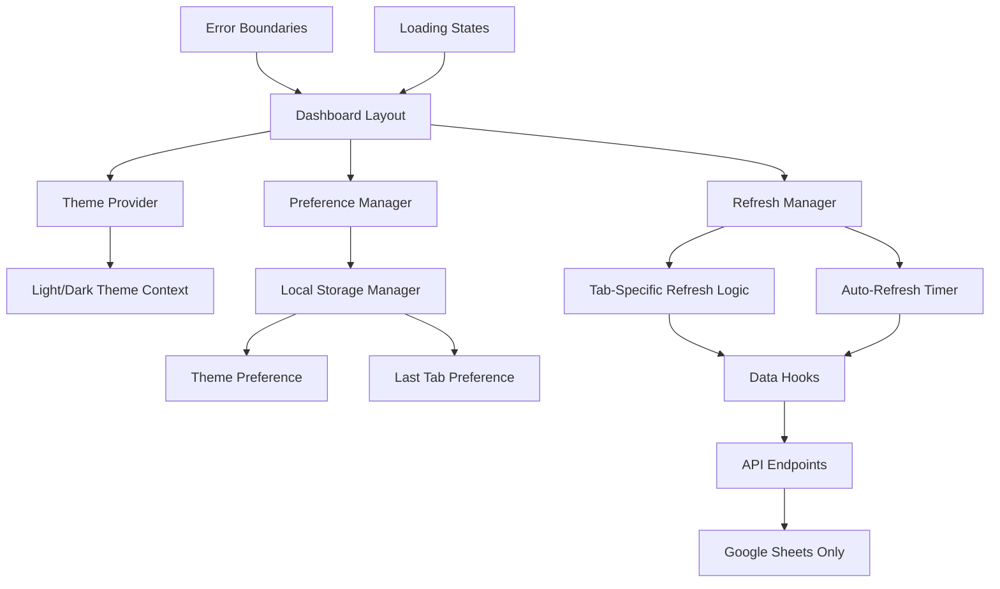
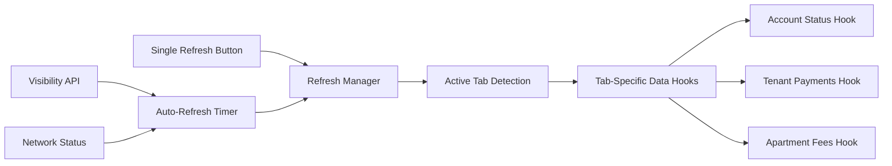

# Design Document

## Overview

This design implements comprehensive dashboard enhancements including centralized refresh management, dark mode support, mock data removal, code cleanup, and user preference persistence. The solution focuses on creating a unified refresh system, implementing theme management, eliminating mock data dependencies, and adding intelligent user preference storage while maintaining the existing Hebrew/RTL support and data integrity.

## Architecture

### Enhanced Dashboard Architecture



### Refresh System Architecture



## Components and Interfaces

### 1. Centralized Refresh Management System

**Purpose**: Implement intelligent refresh that only updates current tab data with auto-refresh capabilities

**Core Components**:
- `RefreshManager.tsx` - Central refresh coordination
- `useRefreshManager.ts` - Hook for refresh logic
- `useAutoRefresh.ts` - Auto-refresh timer management
- `useVisibilityDetection.ts` - Browser tab visibility detection

**Key Interfaces**:
```typescript
interface RefreshManager {
  refreshCurrentTab: () => Promise<void>
  isRefreshing: boolean
  lastRefreshTime: Date | null
  autoRefreshEnabled: boolean
  setAutoRefreshEnabled: (enabled: boolean) => void
}

interface TabRefreshConfig {
  tabId: string
  refreshFunctions: (() => Promise<void>)[]
  isActive: boolean
}

interface AutoRefreshOptions {
  interval: number // 30 seconds default
  pauseWhenHidden: boolean
  pauseOnError: boolean
  maxRetries: number
}
```

**Refresh Manager Implementation**:
```typescript
class RefreshManager {
  private activeTab: string
  private tabConfigs: Map<string, TabRefreshConfig>
  private autoRefreshTimer: NodeJS.Timeout | null
  private isVisible: boolean
  
  refreshCurrentTab(): Promise<void>
  startAutoRefresh(): void
  stopAutoRefresh(): void
  pauseAutoRefresh(): void
  resumeAutoRefresh(): void
}
```

### 2. Theme Management System

**Purpose**: Implement comprehensive dark mode support with proper Hebrew text contrast

**Core Components**:
- `ThemeProvider.tsx` - Theme context and state management
- `useTheme.ts` - Theme hook for components
- `theme-config.ts` - Theme definitions and CSS variables
- `DarkModeToggle.tsx` - Theme toggle button component

**Theme Configuration**:
```typescript
interface ThemeConfig {
  name: 'light' | 'dark'
  colors: {
    background: string
    foreground: string
    card: string
    cardForeground: string
    primary: string
    primaryForeground: string
    secondary: string
    secondaryForeground: string
    muted: string
    mutedForeground: string
    accent: string
    accentForeground: string
    destructive: string
    destructiveForeground: string
    border: string
    input: string
    ring: string
  }
  hebrewTextContrast: {
    primary: string
    secondary: string
    muted: string
  }
}

interface ThemeContextValue {
  theme: 'light' | 'dark'
  setTheme: (theme: 'light' | 'dark') => void
  toggleTheme: () => void
}
```

**CSS Variables for Themes**:
```css
:root {
  --background: 0 0% 100%;
  --foreground: 222.2 84% 4.9%;
  --hebrew-text-primary: 222.2 84% 4.9%;
  --hebrew-text-secondary: 215.4 16.3% 46.9%;
}

[data-theme="dark"] {
  --background: 222.2 84% 4.9%;
  --foreground: 210 40% 98%;
  --hebrew-text-primary: 210 40% 98%;
  --hebrew-text-secondary: 215 20.2% 65.1%;
}
```

### 3. Mock Data Removal System

**Purpose**: Completely eliminate mock data dependencies and ensure only real data display

**Removal Strategy**:
```typescript
interface DataSource {
  type: 'sheets' | 'error'
  isConnected: boolean
  hasData: boolean
}

interface NoDataState {
  type: 'loading' | 'error' | 'empty'
  message: string
  hebrewMessage: string
  canRetry: boolean
  retryAction?: () => void
}
```

**Updated API Response Format** (No Mock Data):
```typescript
interface ApiResponse<T> {
  data: T | null
  meta: {
    isConnected: boolean
    source: 'sheets' | 'error'
    lastFetched: string
    hasData: boolean
  }
  error?: {
    code: string
    message: string
    hebrewMessage: string
    canRetry: boolean
  }
}
```

**Error States Instead of Mock Data**:
```typescript
const NO_DATA_STATES = {
  sheets_unavailable: {
    message: 'Google Sheets connection failed',
    hebrewMessage: 'החיבור לגוגל שיטס נכשל',
    canRetry: true
  },
  no_data_found: {
    message: 'No data available',
    hebrewMessage: 'אין נתונים זמינים',
    canRetry: true
  },
  loading: {
    message: 'Loading data...',
    hebrewMessage: 'טוען נתונים...',
    canRetry: false
  }
}
```

### 4. User Preference Management

**Purpose**: Persist user preferences for theme and last selected tab

**Core Components**:
- `PreferenceManager.ts` - Local storage management
- `usePreferences.ts` - Hook for preference access
- `preference-types.ts` - Type definitions

**Preference Interfaces**:
```typescript
interface UserPreferences {
  theme: 'light' | 'dark'
  lastActiveTab: string
  autoRefreshEnabled: boolean
  refreshInterval: number
  language: 'he' | 'en'
}

interface PreferenceManager {
  getPreference<K extends keyof UserPreferences>(
    key: K
  ): UserPreferences[K] | null
  
  setPreference<K extends keyof UserPreferences>(
    key: K, 
    value: UserPreferences[K]
  ): void
  
  clearPreferences(): void
  
  getAll(): Partial<UserPreferences>
}
```

**Local Storage Implementation**:
```typescript
class LocalStoragePreferenceManager implements PreferenceManager {
  private readonly STORAGE_KEY = 'dashboard-preferences'
  
  getPreference<K extends keyof UserPreferences>(
    key: K
  ): UserPreferences[K] | null {
    try {
      const stored = localStorage.getItem(this.STORAGE_KEY)
      if (!stored) return null
      
      const preferences = JSON.parse(stored) as Partial<UserPreferences>
      return preferences[key] ?? null
    } catch {
      return null
    }
  }
  
  setPreference<K extends keyof UserPreferences>(
    key: K, 
    value: UserPreferences[K]
  ): void {
    try {
      const existing = this.getAll()
      const updated = { ...existing, [key]: value }
      localStorage.setItem(this.STORAGE_KEY, JSON.stringify(updated))
    } catch (error) {
      console.warn('Failed to save preference:', error)
    }
  }
}
```

### 5. Code Cleanup Strategy

**Purpose**: Remove unused code, optimize imports, and improve maintainability

**Cleanup Areas**:
```typescript
interface CleanupAreas {
  unusedImports: string[]
  unusedComponents: string[]
  unusedUtilities: string[]
  unusedDependencies: string[]
  deadCode: string[]
}

interface CleanupResult {
  filesModified: number
  linesRemoved: number
  bundleSizeReduction: number
  dependenciesRemoved: string[]
}
```

**Cleanup Checklist**:
1. Remove all mock data files and references
2. Remove unused React imports
3. Remove unused utility functions
4. Remove unused CSS classes
5. Remove unused npm dependencies
6. Consolidate duplicate code
7. Remove commented-out code
8. Remove unused type definitions

## Data Models

### Enhanced Tab Management

```typescript
interface DashboardTab {
  id: string
  label: string
  icon: React.ComponentType
  refreshFunctions: string[] // Hook names to refresh
  isActive: boolean
}

interface TabState {
  activeTab: string
  tabs: DashboardTab[]
  refreshInProgress: boolean
}
```

### Refresh State Management

```typescript
interface RefreshState {
  isRefreshing: boolean
  lastRefreshTime: Date | null
  autoRefreshEnabled: boolean
  refreshInterval: number
  nextRefreshIn: number
  failedAttempts: number
}

interface TabRefreshStatus {
  [tabId: string]: {
    lastRefreshed: Date | null
    isRefreshing: boolean
    error: string | null
  }
}
```

### Theme State Management

```typescript
interface ThemeState {
  current: 'light' | 'dark'
  systemPreference: 'light' | 'dark'
  userPreference: 'light' | 'dark' | 'system'
  isLoaded: boolean
}
```

## Error Handling

### Enhanced Error States (No Mock Data Fallback)

```typescript
interface ErrorHandlingStrategy {
  showError: (error: ErrorState) => void
  showNoData: (reason: string) => void
  showRetryOption: (retryFn: () => void) => void
  clearError: () => void
}

const ERROR_DISPLAY_COMPONENTS = {
  ConnectionError: ({ onRetry }: { onRetry: () => void }) => JSX.Element,
  NoDataAvailable: ({ message }: { message: string }) => JSX.Element,
  LoadingState: ({ message }: { message: string }) => JSX.Element,
  GenericError: ({ error, onRetry }: { error: ErrorState, onRetry?: () => void }) => JSX.Element
}
```

### Hebrew Error Messages

```typescript
const HEBREW_ERROR_MESSAGES = {
  connection_failed: 'החיבור לגוגל שיטס נכשל. בדוק את החיבור לאינטרנט.',
  no_data_available: 'אין נתונים זמינים כרגע. נסה לרענן את הדף.',
  loading_data: 'טוען נתונים מגוגל שיטס...',
  refresh_failed: 'הרענון נכשל. נסה שוב.',
  auto_refresh_paused: 'הרענון האוטומטי הושהה עקב שגיאות חוזרות.',
  theme_load_failed: 'טעינת העיצוב נכשלה. חוזר לעיצוב ברירת המחדל.'
}
```

## Testing Strategy

### Unit Testing

1. **Refresh Manager Tests**:
   - Test tab-specific refresh logic
   - Test auto-refresh timer functionality
   - Test visibility detection and pause/resume
   - Test error handling and retry logic

2. **Theme Management Tests**:
   - Test theme switching functionality
   - Test preference persistence
   - Test CSS variable updates
   - Test Hebrew text contrast in both themes

3. **Preference Manager Tests**:
   - Test local storage operations
   - Test error handling for corrupted data
   - Test default value fallbacks
   - Test preference validation

### Integration Testing

1. **Dashboard Flow Tests**:
   - Test complete refresh workflow
   - Test theme switching with data refresh
   - Test tab switching with preference saving
   - Test auto-refresh behavior across tabs

2. **Error Scenario Tests**:
   - Test behavior when Google Sheets is unavailable
   - Test network failure recovery
   - Test corrupted preference handling
   - Test theme loading failures

### End-to-End Testing

1. **User Workflow Tests**:
   - Test complete dashboard usage session
   - Test preference persistence across browser sessions
   - Test auto-refresh behavior over time
   - Test error recovery workflows

## Implementation Phases

### Phase 1: Refresh System Foundation
- Implement RefreshManager class
- Create useRefreshManager hook
- Add auto-refresh timer logic
- Implement visibility detection

### Phase 2: Theme Management
- Create ThemeProvider component
- Implement theme switching logic
- Add CSS variables for both themes
- Create dark mode toggle component

### Phase 3: Mock Data Removal
- Remove all mock data files
- Update API endpoints to handle no-data states
- Replace mock data fallbacks with error states
- Update error handling for missing data

### Phase 4: Preference Management
- Implement PreferenceManager class
- Add preference persistence hooks
- Integrate theme preference saving
- Add tab preference saving

### Phase 5: Code Cleanup
- Remove unused imports and components
- Remove unused utility functions
- Remove unused dependencies
- Optimize bundle size

### Phase 6: Integration and Testing
- Integrate all systems in DashboardLayout
- Add comprehensive error boundaries
- Implement loading state coordination
- Add performance optimizations

## Performance Considerations

### Refresh Optimization
- Debounce rapid refresh requests
- Cancel in-flight requests when new ones start
- Implement intelligent retry with exponential backoff
- Cache data to reduce unnecessary API calls

### Theme Performance
- Use CSS variables for instant theme switching
- Preload theme assets
- Minimize layout shifts during theme changes
- Optimize font loading for Hebrew text

### Memory Management
- Clean up auto-refresh timers on unmount
- Prevent memory leaks in preference listeners
- Optimize re-renders with proper memoization
- Clean up event listeners for visibility detection

## Security Considerations

### Preference Storage Security
- Validate preference data before storage
- Sanitize user input for preferences
- Implement preference schema validation
- Handle corrupted preference data gracefully

### API Security
- Maintain secure Google Sheets API credentials
- Implement proper request authentication
- Add rate limiting for refresh requests
- Validate all incoming data without mock fallbacks

### Error Information Security
- Avoid exposing sensitive information in error messages
- Log detailed errors server-side only
- Provide generic user-facing error messages in Hebrew
- Implement secure error reporting mechanisms