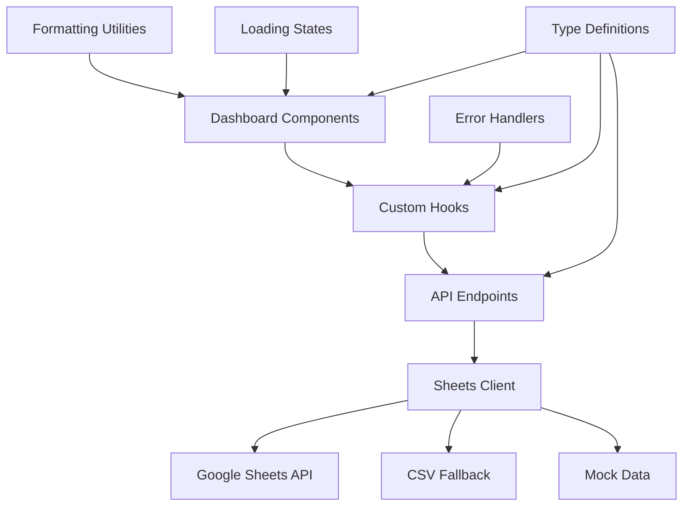
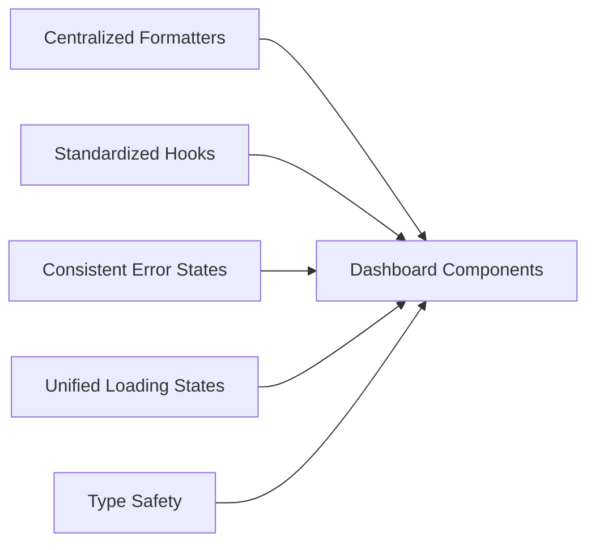

# Design Document

## Overview

This design addresses systematic data display issues in the Hebrew building management dashboard by implementing consistent data formatting, improved error handling, standardized loading states, and proper Hebrew/RTL support. The solution focuses on creating centralized utilities, standardizing API response formats, and ensuring consistent user experience across all dashboard components.

## Architecture

### Data Flow Architecture



### Component Architecture



## Components and Interfaces

### 1. Centralized Formatting System

**Purpose**: Eliminate formatting inconsistencies across components

**Core Utilities**:
- `formatters.ts` - Consolidated formatting functions
- `hebrew-constants.ts` - Hebrew text constants and mappings
- `display-utils.ts` - Display-specific helper functions

**Key Functions**:
```typescript
// Currency formatting with consistent Hebrew locale
formatCurrency(amount: number): string

// Date formatting with Hebrew month names
formatHebrewDate(date: Date | string): string
formatShortHebrewDate(date: Date | string): string
formatMonthYear(date: Date | string): string

// Payment status with consistent icons/colors
formatPaymentStatus(value: string): PaymentStatusDisplay

// Apartment numbering with Hebrew prefix
formatApartmentNumber(number: number | string): string

// Percentage with Hebrew locale
formatPercentage(value: number): string
```

### 2. Standardized API Response Format

**Purpose**: Ensure consistent data structure across all endpoints

**Base Response Interface**:
```typescript
interface ApiResponse<T> {
  data: T
  meta: {
    isConnected: boolean
    source: 'sheets' | 'mock' | 'error'
    lastFetched: string
    message?: string
  }
  error?: {
    code: string
    message: string
    details?: any
  }
}
```

**Component-Specific Interfaces**:
```typescript
interface TenantPaymentData {
  apartment: string
  payments: Record<string, PaymentStatus> // month_1, month_2, etc.
}

interface AccountStatusData {
  balance: number
  lastUpdated: string
  monthlyChange: number
  status: 'healthy' | 'warning' | 'critical'
}

interface PaymentStatus {
  paid: boolean
  amount?: number
  date?: string
}
```

### 3. Enhanced Error Handling System

**Purpose**: Provide consistent, user-friendly error states

**Error Types**:
```typescript
type ErrorType = 
  | 'network_error'
  | 'sheets_connection_error' 
  | 'data_parsing_error'
  | 'authentication_error'
  | 'unknown_error'

interface ErrorState {
  type: ErrorType
  message: string
  hebrewMessage: string
  canRetry: boolean
  retryAction?: () => void
}
```

**Error Components**:
- `ErrorDisplay.tsx` - Standardized error UI
- `RetryButton.tsx` - Consistent retry functionality
- `ConnectionStatus.tsx` - Connection indicator

### 4. Unified Loading States

**Purpose**: Consistent loading experience across components

**Loading States**:
```typescript
interface LoadingState {
  isLoading: boolean
  isRefreshing: boolean
  progress?: number
  message?: string
}
```

**Loading Components**:
- `LoadingSpinner.tsx` - Standard spinner with Hebrew text
- `SkeletonLoader.tsx` - Content placeholders
- `RefreshIndicator.tsx` - Refresh progress indicator

### 5. Enhanced Data Hooks

**Purpose**: Standardize data fetching with proper error handling and loading states

**Base Hook Interface**:
```typescript
interface UseDataHookResult<T> {
  data: T | null
  loading: boolean
  error: ErrorState | null
  isConnected: boolean
  source: string
  lastFetched: Date | null
  refresh: () => Promise<void>
  clearError: () => void
}
```

## Data Models

### Tenant Payments Data Model

```typescript
interface TenantPaymentsResponse {
  data: TenantPaymentRow[]
  year: number
  halfYear: 1 | 2
  statistics: {
    totalPayments: number
    totalPossible: number
    paymentRate: number
  }
}

interface TenantPaymentRow {
  apartment: string
  month_1: PaymentStatus
  month_2: PaymentStatus
  // ... month_12
}
```

### Account Status Data Model

```typescript
interface AccountStatusResponse {
  balance: number
  lastUpdated: string
  monthlyChange: number
  status: AccountHealthStatus
  history?: AccountHistoryEntry[]
}

type AccountHealthStatus = 'healthy' | 'warning' | 'critical'
```

### Apartment Fees Data Model

```typescript
interface ApartmentFeesResponse {
  apartments: ApartmentFee[]
  totalRevenue: number
  averageFee: number
}

interface ApartmentFee {
  apartmentNumber: number
  ownerName: string
  apartmentSize: number
  baseFee: number
  maintenanceFee: number
  totalMonthlyFee: number
  feeType: 'owner' | 'renter'
}
```

## Error Handling

### Error Classification System

1. **Network Errors**: Connection timeouts, DNS failures
2. **Authentication Errors**: Invalid credentials, expired tokens
3. **Data Parsing Errors**: Malformed CSV, unexpected data structure
4. **Google Sheets Errors**: Permission denied, sheet not found
5. **Validation Errors**: Invalid data format, missing required fields

### Error Recovery Strategies

```typescript
interface ErrorRecoveryStrategy {
  immediate: () => Promise<boolean>  // Retry immediately
  delayed: () => Promise<boolean>    // Retry after delay
  fallback: () => Promise<any>       // Use alternative data source
  manual: () => void                 // Require user intervention
}
```

### Hebrew Error Messages

```typescript
const ERROR_MESSAGES = {
  network_error: 'שגיאת רשת - בדוק את החיבור לאינטרנט',
  sheets_connection_error: 'שגיאה בחיבור לגוגל שיטס - בדוק הרשאות',
  data_parsing_error: 'שגיאה בעיבוד הנתונים - פורמט לא תקין',
  authentication_error: 'שגיאת אימות - בדוק את פרטי הגישה',
  unknown_error: 'שגיאה לא ידועה - נסה שוב מאוחר יותר'
}
```

## Testing Strategy

### Unit Testing

1. **Formatter Functions**: Test all formatting utilities with edge cases
2. **Data Parsers**: Test CSV parsing with various Hebrew text scenarios
3. **Error Handlers**: Test error classification and recovery strategies
4. **Type Validation**: Test TypeScript interfaces with runtime validation

### Integration Testing

1. **API Endpoints**: Test complete request/response cycles
2. **Component Integration**: Test data flow from API to UI
3. **Error Scenarios**: Test fallback mechanisms and error states
4. **Loading States**: Test loading transitions and user feedback

### End-to-End Testing

1. **Data Display**: Verify correct formatting across all components
2. **Error Recovery**: Test user workflows during error conditions
3. **Hebrew/RTL Support**: Test text direction and layout
4. **Refresh Functionality**: Test manual and automatic data refresh

### Test Data Strategy

```typescript
// Standardized test data generators
const createMockTenantPayments = (options?: Partial<TenantPaymentsOptions>) => { ... }
const createMockAccountStatus = (status: AccountHealthStatus) => { ... }
const createMockApartmentFees = (apartmentCount: number) => { ... }

// Error simulation utilities
const simulateNetworkError = () => { ... }
const simulateInvalidData = () => { ... }
const simulateAuthError = () => { ... }
```

## Implementation Phases

### Phase 1: Foundation
- Create centralized formatting utilities
- Standardize TypeScript interfaces
- Implement base error handling system

### Phase 2: API Standardization
- Update all API endpoints to use consistent response format
- Implement enhanced error classification
- Add proper data validation

### Phase 3: Component Updates
- Update all dashboard components to use new utilities
- Implement consistent loading states
- Add proper error displays

### Phase 4: Testing & Polish
- Add comprehensive test coverage
- Optimize performance
- Fine-tune Hebrew/RTL support

## Performance Considerations

### Data Caching
- Implement intelligent caching for Google Sheets data
- Cache formatted strings to avoid repeated calculations
- Use React Query or SWR for optimized data fetching

### Bundle Size Optimization
- Tree-shake unused formatting functions
- Lazy load error recovery components
- Optimize Hebrew font loading

### Memory Management
- Prevent memory leaks in data hooks
- Optimize re-renders with proper memoization
- Clean up event listeners and timers

## Security Considerations

### Data Validation
- Validate all incoming data against TypeScript schemas
- Sanitize user inputs and CSV data
- Implement rate limiting for API endpoints

### Error Information Disclosure
- Avoid exposing sensitive information in error messages
- Log detailed errors server-side only
- Provide generic user-facing error messages

### Authentication
- Secure Google Sheets API credentials
- Implement proper token refresh mechanisms
- Add request authentication for sensitive endpoints